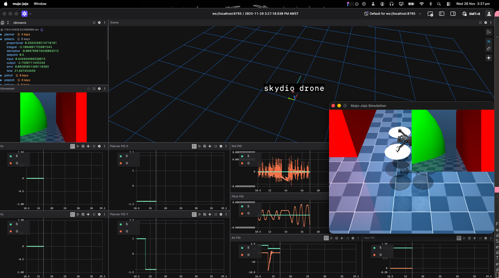

## Mujoco Sys Rust binding


> NB: This has only been tested on MacOS

```bash
# run this and cross fingers (tested on macos only)
bash build.sh
```

Direct bindings that at least work on MacOS. No need to modify sources. just
download or clone into `$BINDGEN_MUJOCO_PATH` , build that project into a build
directory and then cargo build here. You may need to copy over the files
generated shared libraries in `$BINDGEN_MUJOCO_PATH` into a directory that can
be found by the linker in order to run examples.
This project may not work properly on linux - but the others might.

Also make sure glfw is available on your system for easier setup.

to run the examples:

```bash
bash build.sh && cd ./mujoco-sys/examples/ && cargo run --example=basic

bash build.sh && cd ./mujoco-sys/examples/mujo-jojo && cargo run
```


The script will copy the compiled mujoco library in the target folder so that it
can be loaded on run but it may fail on other systems. Worth checking  if its there
in case of errors.



<p align="center">
  <video src="./simulation.webm" width="500px"></video>
</p>

<!---->

